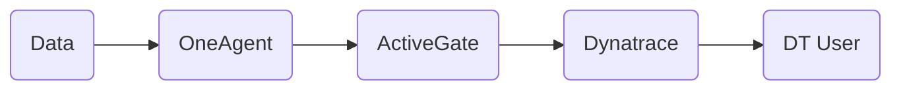
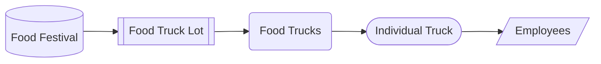
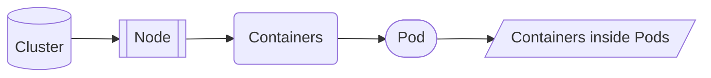

> [!info]
> There are even more available data collection options, not only what is shown in this chapter.
* **[OneAgent](2.%20Data%20Collection.md#[OneAgent](https%20//docs.dynatrace.com/docs/discover-dynatrace/platform/oneagent))**
* **[ActiveGate](2.%20Data%20Collection.md#[ActiveGate](https%20//docs.dynatrace.com/docs/ingest-from/dynatrace-activegate))**
* **[OpenTelemetry & OneAgent SDK](2.%20Data%20Collection.md#[OpenTelemetry](https%20//docs.dynatrace.com/docs/ingest-from/opentelemetry)%20&%20[OneAgent%20SDK](https%20//docs.dynatrace.com/docs/ingest-from/extend-dynatrace/extend-tracing/oneagent-sdk))**
* **[Business Observability](2.%20Data%20Collection.md#[Business%20Observability](https%20//docs.dynatrace.com/docs/observe/business-observability))**
* **[Business Events](2.%20Data%20Collection.md#[Business%20Events](https%20//docs.dynatrace.com/docs/discover-dynatrace/references/semantic-dictionary/model/business-analytics))**
* **[Dynatrace API](2.%20Data%20Collection.md#Dynatrace%20API)**
* **[Kubernetes](2.%20Data%20Collection.md#[Kubernetes](https%20//www.dynatrace.com/technologies/kubernetes-monitoring/?_gl=1%2amgewp7%2a_gcl_aw%2aR0NMLjE3NDM1MzE1MTkuQ2owS0NRanduYTZfQmhDYkFSSXNBTElkMloxZk9qamViT1pXLVk0bGlGVzdxWFFKX1llSnFLa0JFTy1TY0lfRXkwS1h1U0FZVmFIRlJfQWFBbGRVRUFMd193Y0I.%2a_gcl_dc%2aR0NMLjE3NDM1MzE1MTkuQ2owS0NRanduYTZfQmhDYkFSSXNBTElkMloxZk9qamViT1pXLVk0bGlGVzdxWFFKX1llSnFLa0JFTy1TY0lfRXkwS1h1U0FZVmFIRlJfQWFBbGRVRUFMd193Y0I.%2a_gcl_au%2aMTI5ODU2NzgzNC4xNzQwNTAwNDc5%2a_ga%2aNzIyNTY4OTI3LjE3NDA1MDA0Nzk.%2a_ga_1MEMV02JXV%2aMTc0NDcyMzcyNC43OS4xLjE3NDQ3Mjc1OTQuMC4wLjA.))**
* **[Dynatrace Hub](2.%20Data%20Collection.md#[Dynatrace%20Hub](https%20//docs.dynatrace.com/docs/manage/hub))**
* **[Cloud Integrations](2.%20Data%20Collection.md#Cloud%20Integrations)**
* **[Log Ingestion, Masking, and Access](2.%20Data%20Collection.md#[Log%20Ingestion](https%20//docs.dynatrace.com/docs/analyze-explore-automate/logs/lma-log-ingestion),%20Masking,%20and%20Access)**
---

## [OneAgent](https://docs.dynatrace.com/docs/discover-dynatrace/platform/oneagent)
It is responsible for collecting all monitoring data within your monitored environment. A single OneAgent per host is required to collect all relevant monitoring data—even if your hosts are deployed within Docker containers, microservices architectures, or cloud-based infrastructure **[...](https://docs.dynatrace.com/docs/ingest-from/dynatrace-oneagent)**

It's main job is to collect data from the hosts it's installed on and send that data to the Dynatrace platform via **[ActiveGate](#[ActiveGate](https%20//docs.dynatrace.com/docs/ingest-from/dynatrace-activegate))**. Installed on a host or a server.
A single instance of OneAgent can monitor data from servers, processes, services, applications, databases and **[more](https://docs.dynatrace.com/docs/discover-dynatrace/platform/oneagent/how-one-agent-works)**
Each OneAgent deployment process requires selecting a **[Monitoring Modes](3.%20Infrastructure.md#[Monitoring%20Modes](https%20//docs.dynatrace.com/docs/observe/infrastructure-observability/hosts/monitoring-modes))**, HostGroup, Network Zone and some other parameters.
## [ActiveGate](https://docs.dynatrace.com/docs/ingest-from/dynatrace-activegate)
To ensure the **[OneAgent](#[OneAgent](https%20//docs.dynatrace.com/docs/discover-dynatrace/platform/oneagent))** data is sent securely, most companies set up firewall rules for every server that has the OneAgent installed. ActiveGate **receives OneAgent data/traffic**, compresses and encrypts it, and **sends to Dynatrace**. It **only talks outward** – nothing can come in. That helps keep servers safe from unwanted visitors or attacks.
* Acts as a proxy between OneAgents and Dynatrace Clusters
* Many OneAgents can speak to one ActiveGate
* It is also capable of performing monitoring tasks using **[Dynatrace API](#Dynatrace%20API)**

Instead of every OneAgent needing direct access through your firewalls to reach Dynatrace, **ActiveGate can collect data from multiple OneAgents** at once and only then send it further. It's like having a post office organising all mail instead of manually sending each mail to the recipient.
* **Keeps servers safe**
    No one has to come in — only safe, one-way traffic goes out.
* **Makes things run smoother**
    Less traffic means faster, cleaner performance.
* **Easier to manage**
    No need to open special firewall doors for every system.
* **Stay in control**
    User decides what gets sent out and when.
## [OpenTelemetry](https://docs.dynatrace.com/docs/ingest-from/opentelemetry) & [OneAgent SDK](https://docs.dynatrace.com/docs/ingest-from/extend-dynatrace/extend-tracing/oneagent-sdk)
Capture data that Dynatrace doesn't collect by default.

Whether we want to capture a missing value, monitor an unsupported technology, or enrich existing traces, Dynatrace gives us flexible tools to extend what's collected.
* **Default Capture Isn't Always Enough**
	Dynatrace automatically collects metrics, logs, traces, and more, but it may not capture every value or field your app uses. That's when you need to customise what gets collected.
* **OpenTelemetry for Custom Traces**
	OpenTelemetry allows defining custom spans or traces, like capturing a specific method, header, or value that Dynatrace doesn't pick up automatically.
* **Monitor Systems Without OneAgent**
	If OneAgent can't be installed on a host, or if Dynatrace doesn't support the technology, OpenTelemetry is still an option.
* **Capture Request-Level Data with the OneAgent SDK**
	For even more control, the OneAgent SDK lets you collect specific request-level data Dynatrace might miss, like a cart total during checkout.
* **Bring It All Together in Dynatrace**
	Dynatrace automatically merges native data, OpenTelemetry inputs, and SDK-collected values into unified traces.
## [Business Observability](https://docs.dynatrace.com/docs/observe/business-observability)
Dynatrace Business Observability connects application performance and user experience to business metrics, enabling business and IT teams to collaborate through shared real-time perspectives. Business Observability leverages business events to achieve the precision many business use cases demand.
## [Business Events](https://docs.dynatrace.com/docs/discover-dynatrace/references/semantic-dictionary/model/business-analytics)
Tracking important business values, like a **user ID**, **cart value**, **membership level**, or **transaction amount**, but it’s buried inside a span or log. In this case we can leverage Business Events.
* **Log or Span as Source**
	Every value has a home. In Dynatrace, that home might be a log or a span. That's where we begin the journey to track meaningful business data.
* **Create a Rule**
	Create a rule that tells Dynatrace what to look for, like a chart total or user ID, and where to find it inside the data source.
* **Extract the Value**
	Just like threading a needle, Dynatrace extracts the exact detail you're looking for, carefully pulling a single value from a much larger set of data.
* **Save as Business Event**
	The value is saved as a Business Event. These are often created by Dynatrace admins but are visible to all users across your dashboards and tools.
* **Query and Visualise**
	Stored Business Events can be queried with DQL, added to dashboards, or visualised in notebooks. If no custom bucket is used, the default bizevent bucket stores them for 35 days.
## Dynatrace API
With API users can manage Dynatrace programmatically
* Create or configure **dashboards**
* Pull out **logs** and **metrics**
* **Modify** Dynatrace **settings**  
* **Push data into 3rd party programs** such as **Power BI** or **Excel**

> [!faq]- When is this useful?
> You might think “if I can do it in the UI, why not just do it there”.
> Yes, in most cases using the UI is perfectly fine, however if you want to automate the changing of a setting, move a dashboard from one environment to another, or simply need to pull Dynatrace data, the API could be more helpful.

Basically, **anything** **you** can **do in the UI**, **you can** also **do via the API**.
## [Kubernetes](https://www.dynatrace.com/technologies/kubernetes-monitoring/?_gl=1%2amgewp7%2a_gcl_aw%2aR0NMLjE3NDM1MzE1MTkuQ2owS0NRanduYTZfQmhDYkFSSXNBTElkMloxZk9qamViT1pXLVk0bGlGVzdxWFFKX1llSnFLa0JFTy1TY0lfRXkwS1h1U0FZVmFIRlJfQWFBbGRVRUFMd193Y0I.%2a_gcl_dc%2aR0NMLjE3NDM1MzE1MTkuQ2owS0NRanduYTZfQmhDYkFSSXNBTElkMloxZk9qamViT1pXLVk0bGlGVzdxWFFKX1llSnFLa0JFTy1TY0lfRXkwS1h1U0FZVmFIRlJfQWFBbGRVRUFMd193Y0I.%2a_gcl_au%2aMTI5ODU2NzgzNC4xNzQwNTAwNDc5%2a_ga%2aNzIyNTY4OTI3LjE3NDA1MDA0Nzk.%2a_ga_1MEMV02JXV%2aMTc0NDcyMzcyNC43OS4xLjE3NDQ3Mjc1OTQuMC4wLjA.)
One of the most powerful tools for managing modern applications.
By comparing it to something familiar, like a food truck festival, we can make sense of how its components work together.

* **Cluster → Entire Food Festival**
	The cluster is the big picture, many nodes working together to serve your customers (or run your applications).
* **Node → Food Truck Lot**
	A node is a location that hosts multiple pods, like a lot with several trucks. Each node runs many processes at once.
* **Containers → Food Trucks**
	Containers are like food trucks: small, focused, and built to do one thing really well. Each container runs one specific process with just what it needs.
* **Pods → Individual Trucks**
	In Kubernetes, a pod wraps around one or more containers. Think of it as the food truck itself, running the show for that specific task.
* **Containers inside Pods → Employees**
	The containers inside a pod are like the employees in the truck, each doing a specific job to serve food (or run code).

* 
* **Dynatrace Operator → Monitoring Team**
	The Dynatrace Operator is like the monitoring crew. It installs OneAgent, collects metrics, and sends status info back to Dynatrace so you can see how everything's performing.
## [Dynatrace Hub](https://docs.dynatrace.com/docs/manage/hub)
**Think of it like the app store for Dynatrace.**

It lets you browse, activate, and start-up
* Dynatrace Pre-Built Public Apps like Learn DQL.
* Extensions like the ones for Tomcat or Kafka.

> [!example]- TomCat Extension
**What does it do?**
It tells OneAgent to start collecting extra Tomcat-specific metrics, things like thread counts or request volumes. Additionally, an ActiveGate can be configured to gather these metrics remotely.
**Where can I see the data being colleclted?**
Most extensions have a pre-made dashboard which contains all of the data the plug-in is gathering as well as entities like custom devices that house the plugin data. From there, you can select metrics or entities to take a closer look.
**Where can I find more information?**
Additional information about the extension can be found in the Dynatrace HUB. If you search the Hub for a technology in your environment, and it’s not listed, don’t worry. Custom extensions can be created to ingest data from almost any technology.

## Cloud Integrations
By using cloud integrations, you can monitor cloud environments such as **AWS**, **Azure** or other cloud platforms. Cloud integrations let you do that, even without installing OneAgent on hosts in your cloud environment.

You’ll get a high-level view of your cloud resources, and Dynatrace will automatically pull in metadata like instance **names**, **tags**, and **basic infrastructure metrics**.

> If you want deeper visibility, like logs, process metrics, services and traces, you’ll **still want to install OneAgent**. But these integrations are a great addition, especially for distributed or hybrid cloud environments.
## [Log Ingestion](https://docs.dynatrace.com/docs/analyze-explore-automate/logs/lma-log-ingestion), Masking, and Access
Log ingestion helps to collect log data from multiple different sources:
* **Ingest from many sources**
	  Dynatrace supports log ingestion from a variety of sources not just logs collected by the OneAgent. For example, if there is a network device that cannot install OneAgent, those logs can be sent to the Dynatrace API for ingestion and processing. This means you can centralize your log data, even if it's not coming from a host with OneAgent installed.
* **Define exactly what logs get stored**
	  Define exactly what logs get stored: You can fine-tune which logs are stored and which are filtered out, giving you flexibility to manage data volume and focus on useful insights.
* **Mask sensitive data**
	  Protect sensitive information like sensitive code information, tokens, and API keys by automatically masking it during ingestion.
* **Manage log access**
	  Use role-based access settings to control who can view different types of log data, keeping security and privacy in check.
* **Reduce unnecessary storage**
	  Exclude low-priority logs or set rules to retain only high-value data. This helps optimize licensing costs without losing visibility.

Dynatrace empowers us to take full control of our log data. By customising ingestion and retention rules, we optimise our environments for efficiency, security, and streamlined analysis!