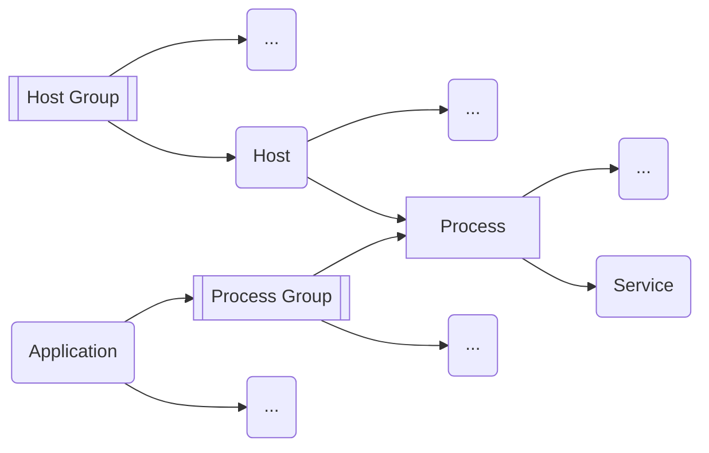

* **[Smartscape Topology ©](3.%20Infrastructure.md#[Smartscape%20Topology](https%20//docs.dynatrace.com/docs/discover-dynatrace/platform/smartscape)%20©)**
* **[Monitoring Modes](3.%20Infrastructure.md#[Monitoring%20Modes](https%20//docs.dynatrace.com/docs/observe/infrastructure-observability/hosts/monitoring-modes))**
* **[Host](#[Host](https%20//docs.dynatrace.com/docs/observe/infrastructure-observability/hosts))**
* **[Process & Process Group](3.%20Infrastructure.md#Process%20&%20Process%20Group)**
* **[Service](3.%20Infrastructure.md#Service)**
* **[Host Groups](3.%20Infrastructure.md#[Host%20Groups](https%20//docs.dynatrace.com/docs/observe/infrastructure-observability/hosts/configuration/organize-your-environment-using-host-groups%20how-host-groups-affect-your-monitoring-environment))**
* **[Naming Rules](3.%20Infrastructure.md#Naming%20Rules)**
* **[Tags](3.%20Infrastructure.md#Tags)**
* **[Databases](3.%20Infrastructure.md#[Databases](https%20//docs.dynatrace.com/docs/observe/infrastructure-observability/databases/database-services-classic/how-database-activity-is-monitored%20how-database-activity-is-monitored))**
* **[Web Applications](3.%20Infrastructure.md#[Web%20Applications](https%20//docs.dynatrace.com/docs/observe/digital-experience/web-applications))**
---
## [Smartscape Topology](https://docs.dynatrace.com/docs/discover-dynatrace/platform/smartscape) ©
Just like devices (phones, laptops) connecting to a shared printer, the same way different components (services and hosts) are connected and interact within an IT environment.
> Shows connections between: Applications, Services, Processes, Hosts, Data centers

## [Monitoring Modes](https://docs.dynatrace.com/docs/observe/infrastructure-observability/hosts/monitoring-modes)
- **Foundation & Discovery Mode**
    is ideal for kiosks, POS systems, or endpoints where you only need to confirm availability.
	> CPU, Memory, Availability, Disk, Network
- **Infrastructure Only**
    collects logs and metrics from both the host as well as the processes of that host.  
    is often used for database servers.
	> Process Injection: runtime metrics for Java; .NET; Node.js; Golang; etc
- **Full-Stack**
    Full-Stack gives us the most data from the host and process layer, and also collects traces from the services layer.

## [Host](https://docs.dynatrace.com/docs/observe/infrastructure-observability/hosts)
any kind of computer or server that has the Dynatrace **[OneAgent](2.%20Data%20Collection.md#[OneAgent](https%20//docs.dynatrace.com/docs/discover-dynatrace/platform/oneagent))** installed on it.

Once you install the OneAgent on a host, it immediately begins collecting performance and health metrics about that host, like CPU usage, memory consumption, disk activity, and running processes.
Host is any **cloud**, **virtual**, or **physical** device that helps support an application.
#### Process & Process Group
**Process** is an instance of an executed computer program process to serve as containers that host services.
**Process Group** is a logical cluster of processes that belong to the same application or deployment unit and perform the same function across multiple hosts.
#### Service
Is a server-side code executed within a process group.
> e.g. A user clicks a link, a service handles the request, and sends back the page.

The service **runs inside the process**, but it’s the service that does the actual work of responding to the user.
#### [Host Groups](https://docs.dynatrace.com/docs/observe/infrastructure-observability/hosts/configuration/organize-your-environment-using-host-groups#how-host-groups-affect-your-monitoring-environment)
Multiple hosts that serve similar purposes can be organised into groups.

> [!example]- Example
> You have **ten hosts** managed **by** the **Astroshop Frontend team**. **Five** are used for **production**, and **five** are for **non-production**. Both environments **run the same processes**. Because the processes are identical, Dynatrace groups them into the **same process group**. This combines production and non-production data, making it hard to **distinguish between environments**. To fix this, you assign host groups:
> * Astroshop-Frontend-**Production** for production hosts.
> * Astroshop-Frontend-**NonProduction** for non-production hosts.
> 
> After restarting the process, Dynatrace recognizes the host groups and **separates the environments into different process groups**, **restoring clarity** in your monitoring.

* A **host** can only belong to **one host group**.
* Host groups **are defined during** OneAgent **installation**.
* If you need to **assign or change** a host group, you will typically **reinstall the OneAgent** with the correct group name.
* Dynatrace also **allows advance users to change** those groups using **command-line** tools (like OneAgentCTL).
###### Naming Rules
Customise how entities appear in Dynatrace for improved clarity.
> like **_svc-12345_** _to_ **_OnlineBoutique-LoginService_**
> Can be set for: **[Host](https://docs.dynatrace.com/docs/observe/infrastructure-observability/hosts/configuration/set-custom-host-names-in-dynamic-environments)**, **[Process](https://docs.dynatrace.com/docs/observe/infrastructure-observability/process-groups/configuration/pg-naming)**, **[Service](https://docs.dynatrace.com/docs/observe/application-observability/services/service-detection/service-detection-v1/customize-service-naming)**, **[Request](https://docs.dynatrace.com/docs/observe/application-observability/services/service-detection/service-detection-v1/set-up-request-naming)**
###### Tags
Filter data, Build dashboards, set alerting conditions, assign ownership, etc.

Helps to narrow down whats relevant. Can be applied to nearly any entity, hosts, services, applications, etc.
## [Databases](https://docs.dynatrace.com/docs/observe/infrastructure-observability/databases/database-services-classic/how-database-activity-is-monitored#how-database-activity-is-monitored)
The application/middleware server makes calls to the database as opposed to on the database itself and gets the queries
- **Database Only Monitoring** (OneAgent is installed only on the database)  
    Monitors the activity on the database, but not the in/out requests.
- **App Server Only Monitoring** (OneAgent is installed only on the app server)  
    Sees the activity, but not how the database is handling it.
- **App and Database Monitoring** (OneAgent is installed on **both** the database and the app server)  
    Now we have **full visibility** into the request, the response, and the performance of each system.

Database queries are monitored on the application servers sending them out and not on the databases themselves, which means, code level details on the database won’t provide any other details.
## [Web Applications](https://docs.dynatrace.com/docs/observe/digital-experience/web-applications)
Is a front-end of an application that can be accessed via a browser or mobile app.  
Tracks the user’s experience when they interact with a website or an app.
- **User Actions**  
    Clicks or user interactions.
- **XHR Actions**  
    Background requests, that update a parts of a page (like clicking "Next" in a photo gallery).
- **Custom Actions**  
    Business-specific actions that are being tracked manually (like PDF downloads, using the Dynatrace JavaScript API (OpenKit)).

By default, Dynatrace groups all web traffic under "My Web Application".

---