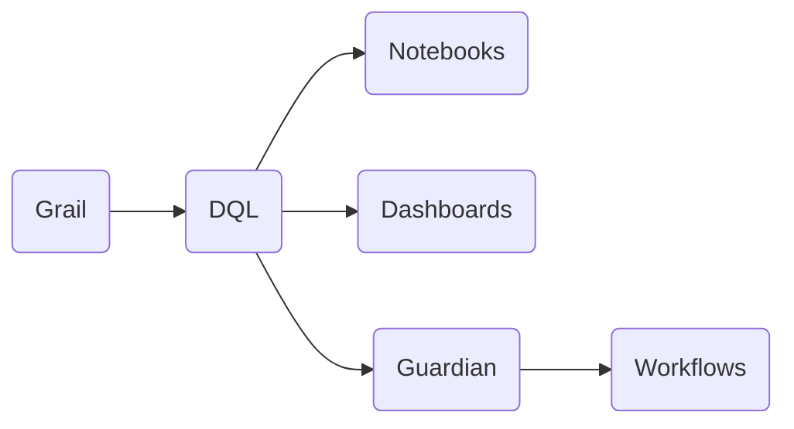

The Grail data lakehouse at the heart of the Dynatrace platform enables contextual analytics across unified observability, security, and business data. As a data lakehouse, Grail combines the cost efficiency advantages of data lakes with the analytics capabilities of data warehouses, and adds extreme performance through massively parallel processing.

## [Grail](https://docs.dynatrace.com/docs/discover-dynatrace/platform/grail/organize-data#built-in-grail-buckets)

is a causational data Lakehouse with a **massively parallel processing** (MPP) analytics engine.

The goal of Grail is to go through enormous amounts of data faster and be able to keep up with the increasing demand.

Dynatrace enlists the help of dozens or even hundreds of helper servers to help find, analyze, organize, and display the exact data we are looking for.
#### [Buckets](https://docs.dynatrace.com/docs/discover-dynatrace/platform/grail/organize-data#built-in-grail-buckets)
are the logical storage units where records are stored. Buckets are always associated with a specific record type, such as logs, events, or spans. Each record type has a predefined built-in bucket. Administrators can create custom buckets to optimize performance, apply different retention times, or meet specific compliance requirements

All monitoring data in Grail is assigned and organized into different buckets, based on its type and purpose.
## [DQL](https://wkf10640.apps.dynatrace.com/ui/apps/dynatrace.learndql/)
Both the new Dashboards and Notebooks apps use DQL, Dynatrace Query Language, to pull data from Grail, Dynatrace’s high-speed data Lakehouse.

The benefits of using DQL are:
• Faster loading times for large datasets.
•  More flexible than the Data Explorer.

  

DQL is a powerful and flexible tool, but it does come with a learning curve. You don’t need to be a developer to use it effectively, just a bit of practice and familiarity will go a long way.

  

  

Remember, we learned about Grail and how it works in Lesson 2: Dynatrace Architecture.

  

------

What is a typical DQL query made of?

A typical DQL query is made of steps, connected by a pipe symbol like this:

  

fetch logs

| filter content contains "warning"

  

  

It's like giving instructions to a helpful assistant

First, fetch the logs.

Then, filter the results to only show logs with the word "warning"

From here we can keep refining data to pull exactly what we need.

-----

  

Don’t worry if DQL feels overwhelming at first. The good news is that most queries aren’t written from scratch.

Dynatrace offers autocomplete and templates to help you build queries efficiently. It also allows you to convert visual charts from the Data Explorer into DQL to learn by example!

## Notebooks ©

Notebooks are like dashboards with memory. They don’t refresh automatically. Instead, they capture data at a specific point in time.

 A great example of when to use a Notebook? Black Friday.

If you want to analyze exactly what happened on that high-traffic day, create a notebook. It freezes the data and saves it for future comparison, perfect for spotting year-over-year trends. Just be sure to not re-run any queries in the Notebook or the data might get lost.

  

  

In short:

We recommend using dashboards for real-time views.

While notebooks are better equipped to capture and examine historical data.  

Now let’s see how both Notebooks and Dashboards work in action.

  

  

## Dashboards ©

Dashboards transform raw data into visual insights, making it easier to spot trends, monitor performance, and share findings with your team.

You can build dashboards using tiles, which can be either pre-made or custom. Simply drag and drop the tiles you need, then configure filters, time frames, visualizations, titles, and more to tailor the view to your needs.

The Dashboards app also supports DQL (Dynatrace Query Language). This means every tile is powered by a DQL query, even if it’s not immediately visible, giving you full control over the data you display.

  

Share it

With team members or entire groups

  

Set time frames

Customize the default time frame so it always opens with the right context

  

  

Fun Fact: You can even share dashboards with people who don’t have a Dynatrace account. So yes, even a family member can view your dashboard. No login required.

## Site Reliability Guardian ©

## Workflows ©
Another way to extend Dynatrace’s capabilities is with Workflows.

Workflows let you automate tasks inside Dynatrace. Think of them like a script builder or step by step instructions for Dynatrace to follow.

You could use them to:  
Push external log data into Dynatrace  
Trigger an alert when a threshold is breached  
Call a webhook  
Or even bring in external data, like cat facts

  

Yes, that's right. There's a workflow that pulls cat facts from an API every 10 minutes and saves them as logs in Dynatrace. The limit is your imagination. Workflows can automate almost anything!