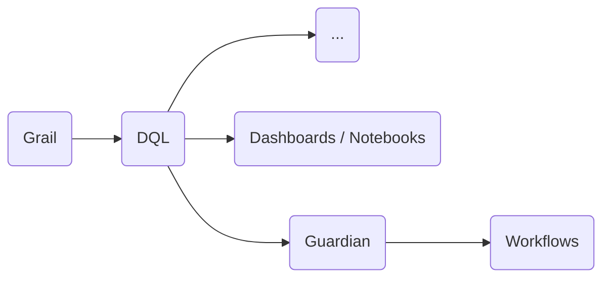

* **[Data Lakehouse](5.%20Data%20Visualisation.md#[Data%20Lakehouse](https%20//docs.dynatrace.com/docs/discover-dynatrace/platform/grail/dynatrace-grail/data-lakehouse))**
* **[Grail](5.%20Data%20Visualisation.md#[Grail](https%20//docs.dynatrace.com/docs/discover-dynatrace/platform/grail/organize-data%20built-in-grail-buckets))**
* **[Dynatrace Query Language (DQL)](5.%20Data%20Visualisation.md#[Dynatrace%20Query%20Language%20(DQL)](https%20//docs.dynatrace.com/docs/discover-dynatrace/platform/grail/dynatrace-query-language))**
* **[Dashboards ©](5.%20Data%20Visualisation.md#[Dashboards](https%20//docs.dynatrace.com/docs/analyze-explore-automate/dashboards-and-notebooks/dashboards-new)%20©)**
* **[Notebooks ©](5.%20Data%20Visualisation.md#[Notebooks](https%20//docs.dynatrace.com/docs/analyze-explore-automate/dashboards-and-notebooks/notebooks)%20©)**
* **[Site Reliability Guardian ©](5.%20Data%20Visualisation.md#[Site%20Reliability%20Guardian](https%20//docs.dynatrace.com/docs/deliver/site-reliability-guardian)%20©)**
* **[Workflows ©](5.%20Data%20Visualisation.md#[Workflows](https%20//docs.dynatrace.com/docs/analyze-explore-automate/workflows)%20©)**
---
## [Data Lakehouse](https://docs.dynatrace.com/docs/discover-dynatrace/platform/grail/dynatrace-grail/data-lakehouse)
The Grail data lakehouse at the heart of the Dynatrace platform enables contextual analytics across unified observability, security, and business data. As a data lakehouse, Grail combines the cost efficiency advantages of data lakes with the analytics capabilities of data warehouses, and adds extreme performance through massively parallel processing.



## [Grail](https://docs.dynatrace.com/docs/discover-dynatrace/platform/grail/organize-data#built-in-grail-buckets)
Is a causational data Lakehouse with a **massively parallel processing** (MPP) analytics engine.
> The goal of Grail is to go through enormous amounts of data faster and be able to keep up with the increasing demand.

Dynatrace enlists the help of dozens or even hundreds of helper servers to help find, analyse, organise, and display the exact data we are looking for.
#### [Buckets](https://docs.dynatrace.com/docs/discover-dynatrace/platform/grail/organize-data#built-in-grail-buckets)
Buckets are the logical storage units where records are stored. Buckets are always associated with a specific record type, **such as logs, events, or spans**.
Each record type has a predefined built-in bucket. Administrators can create custom buckets to optimize performance, apply different retention times, or meet specific compliance requirements

> All monitoring data in Grail is assigned and organised into different buckets, based on its type and purpose.
## [Dynatrace Query Language (DQL)](https://docs.dynatrace.com/docs/discover-dynatrace/platform/grail/dynatrace-query-language)
* **[Use DQL queries](https://docs.dynatrace.com/docs/discover-dynatrace/platform/grail/dynatrace-query-language/dql-guide)**

With DQL, you can **spot trends**, **find anomalies** and outliers, **statistical modeling** and **understand system behavior**. DQL is built for processing arbitrary event data and requires no up-front description of the input data's schema contrary to relational databases like SQL tables.

The benefits of using DQL are:
* Faster loading times for large datasets.
* More flexible than the Data Explorer.

Dynatrace offers autocomplete and templates to help you build queries efficiently. It also allows you to convert visual charts from the Data Explorer into DQL to learn by example!

> [!TIP]
> For Associate Exam is important to learn **[DQL basics](https://wkf10640.apps.dynatrace.com/ui/apps/dynatrace.learndql/)** and also to understand how to ```| parse``` data **[correctly](https://docs.dynatrace.com/docs/platform/grail/dynatrace-pattern-language/log-processing-lines-strings#line-data)**.
#### Task example
> Extend the query and `parse` the field `content` and extract the value of `tenantId` and `duration`.

> [!example]- Hint
A typical content field looks like `Tue, 15 Nov 2022 07:03:36 GMT FunctionInvocation: tenantId=yke63078, duration=400 ms`.

Build your pattern step by step:
- Ignore all information until `tenantId=` by starting your pattern with **[`LD`](https://docs.dynatrace.com/docs/shortlink/dpl-lines-strings#line-data)**.
- Then match the value of `tenantId` with the **[`WORD`](https://www.dynatrace.com/support/help/shortlink/dpl-lines-strings#posix-character-classes)** character class.
- Add the known separator `, duration=` as the next part of your pattern.
- Extract the value of the duration with a numeric matcher like **[`INTEGER`](https://www.dynatrace.com/support/help/shortlink/dpl-numeric-data#int-integer)**.
```python
fetch logs
| filter log.source == "dql-exercise" and contains(content, "FunctionInvocation")
| fields timestamp, content
...
```
> [!ANSWER]-
>  ```python
>  | parse content, "LD 'tenantId=' WORD:tenantId, ', duration=', INT:duration"
>  ```
## [Dashboards](https://docs.dynatrace.com/docs/analyze-explore-automate/dashboards-and-notebooks/dashboards-new) ©
Transform **raw data** into **visual insights**, making it easier to spot trends, monitor performance, and share findings with your team.

The Dashboards app supports **DQL**. This means every tile is powered by a DQL query, even if it’s not immediately visible, giving you full control over the data you display.
* **Share it**
	With team members or entire groups
* **Set time frames**
	Customise the default time frame so it always opens with the right context

> [!TIP]
> #### Fun Fact
> You can even share dashboards with people who don’t have a Dynatrace account. So yes, even a family member can view your dashboard. No login required.
## [Notebooks](https://docs.dynatrace.com/docs/analyze-explore-automate/dashboards-and-notebooks/notebooks) ©
Like dashboards with memory. They don’t refresh automatically. Instead, they **capture data at a specific point in time**.

If you want to analyse exactly what happened on that high-traffic day, create a notebook. It freezes the data and saves it for future comparison, perfect for spotting year-over-year trends. Just be sure to not re-run any queries in the Notebook or the data might get lost.

> [!TIP]
> #### Recommendation
> Use **dashboards for real-time views**, while **notebooks** are better **equipped to capture and examine historical data**.
## [Site Reliability Guardian](https://docs.dynatrace.com/docs/deliver/site-reliability-guardian) ©
Dynatrace app that automates change impact analysis to validate service availability, performance, and capacity objectives across various systems. It enables DevOps platform engineers to make the right release decisions and empowers SREs to apply **Service-Level Objectives (SLOs)** for their critical services.
There are 2 Guardian types defined by Dynatrace:
#### Lifecycle guardian (SDLC events) 
- Reads and writes [SDLC events](https://docs.dynatrace.com/docs/deliver/pipeline-observability-sdlc-events/sdlc-events "You can observe your pipeline through software development lifecycle (SDLC) events which you can then ingest to use to generate analytics.") as validation results.
- It is aligned with the [validation events specification in the Semantic Dictionary](https://docs.dynatrace.com/docs/semantic-dictionary/model/sdlc-events#sdlc-validation-events "Get to know the Semantic Dictionary models related to Software development lifecycle (SDLC) events.").
- It is intended to be used in the context of the Software Development Lifecycle.
    - As a quality gate in progressive delivery scenarios
    - As a performance indicator after load testing
    - As a continuous health monitor for services and components
#### Business guardian (Business events) 
- Reads and writes [Business events](https://docs.dynatrace.com/docs/observe/business-observability/bo-api-ingest "Set up authentication for and ingest business events via API.") as validation results
- It is intended for business-level usage and insights into application behavior

> As these two types of guardians have different data sources (`bizevents` vs. `events`) and different event data structures, you need to adapt your DQL queries that target guardian validation events in Notebooks or Dashboards when switching from one type to the other. For more details on the structural differences, see [Site Reliability guardian event structure](https://docs.dynatrace.com/docs/deliver/site-reliability-guardian/event-structure "Details about the event structure of the Site Reliability Guardian.").
## [Workflows](https://docs.dynatrace.com/docs/analyze-explore-automate/workflows) ©
> **[AutomationEngine](https://docs.dynatrace.com/docs/platform/automationengine)**

Workflows let you automate tasks inside Dynatrace. Think of them like a **script builder** or step by step instructions for Dynatrace to follow.

You could use them to:
* Push external log data into Dynatrace  
* Trigger an alert when a threshold is breached  
* Call a **webhook**  
* Or even bring in external data
---