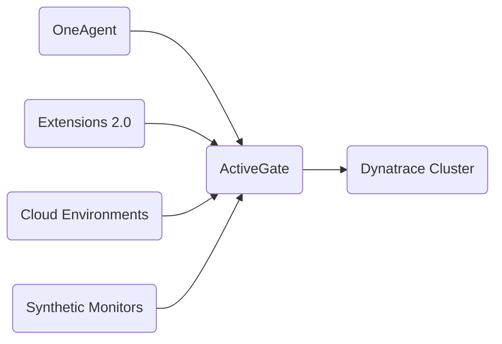

* **[Platform Health](#Platform%20Health)**
* **[OneAgent Health](#OneAgent%20Health)**
* **[ActiveGate Health & Diagnostics](#ActiveGate%20Health%20%26%20Diagnostics)**
* **[Real-User Monitoring Health](#Real-User%20Monitoring%20Health)**
* **[Extension Lifecycle](#Extension%20Lifecycle)**
* **[Self-Monitoring Metrics](#Self-Monitoring%20Metrics)**
* **[Platform Configuration](#Platform%20Configuration)**
* **[SSO Configuration](#SSO%20Configuration)**
* **[User & Group Configuration](#User%20%26%20Group%20Configuration)**
* **[ActiveGate Configuration](#ActiveGate%20Configuration)**
* **[Log Ingestion](#Log%20Ingestion)**
* **[Application Security Activation](#Application%20Security%20Activation)**
* **[Cloud Provider Monitoring](#Cloud%20Provider%20Monitoring)**
* **[Kubernetes Monitoring](#Kubernetes%20Monitoring)**

---

## Platform Health
Monitoring the health of your platform's components **at scale** ensures anomalies can be resolved with minimal impact. Use **self-monitoring metrics** to streamline and speed up remediation.

> [!NOTE]
> #### Why proactive monitoring matters
> Even the tools you use to monitor your environment need to be monitored. OneAgents can go stale, ActiveGates can lose connectivity, and extensions can silently stop collecting data.

## OneAgent Health
In the **OneAgent Health overview** you can:
* Detect **outdated modules** that require updates
* Discover **connectivity issues** and incompatibilities
* **Restart stopped processes**
* Identify OneAgents where **auto-updates are disabled**

#### OneAgent Monitoring Modes ©
Each deployment requires selecting a monitoring mode. This affects what data is collected and how licensing is calculated.

| Mode | What it monitors | DPS unit |
|---|---|---|
| **Full-Stack** | Host + processes + services + traces + RUM + AppSec | GiB-hours (memory) |
| **Infrastructure** | Host + processes + detailed metrics, no code-level | host-hours (flat) |
| **Foundation & Discovery** | CPU, memory, availability, disk, network only | host-hours |
| **Mainframe** | IBM z/OS — 30+ technologies | MSU-based |

> [!TIP]
> #### Changing Monitoring Mode
> ```bash
> oneagentctl --set-monitoring-mode=FULL_STACK
> oneagentctl --set-monitoring-mode=INFRASTRUCTURE
> oneagentctl --set-monitoring-mode=DISCOVERY
> ```
> Or via UI: **Hosts Classic → host page → More (…) → Settings → Host Monitoring**

#### Full-Stack specifics
* Code-level visibility, distributed tracing, CPU/memory/thread profiling
* Includes RUM, services, full Application Security assessment
* **900** custom metric data points per GiB of host memory per 15-min interval

#### Infrastructure Mode specifics
* Detailed process performance + disk + network + per-process memory
* Auto-injects into processes for Java backing services and runtime metrics
* **1,500** custom metric data points per host per 15-min interval
* Extensions can be enabled on infrastructure-monitored hosts

#### Foundation & Discovery specifics
* Does **NOT** include custom metrics
* Available **only** with Dynatrace Platform Subscription (DPS)

#### Application Security & monitoring mode ©
| Mode | AppSec capability |
|---|---|
| Full-Stack | Full vulnerability assessment |
| Infrastructure | Limited — no public internet exposure or reachable data assets |
| Discovery | Requires enabling code-module injection separately |

> In Infra/Discovery modes: **Dynatrace Security Score = CVSS base score** (no Davis adaptation)

#### OneAgent Auto-Update ©
Three update modes (configurable at global, host group, or host level):
1. **Automatic updates at earliest convenience** — updates regardless of windows
2. **Automatic updates during update windows** — only within configured windows
3. **No automatic updates** — manual only

**Hierarchy (most specific wins):**
```
Host level → Host Group level → Environment (global) level
```

Key facts:
* Auto-update is **ON** by default globally
* Dynatrace waits **45 minutes** before updating after a new version is available
* **"Update now"** skips the 45-min delay — immediate
* After update, **monitored processes must be restarted** for the new version to take effect
* **PaaS and standalone OneAgents** do NOT show the "Update" button in UI
* Update windows do **NOT apply in Kubernetes** (managed by the Operator)
* Target versions: **Latest**, **Previous stable**, **Older stable**
* Cannot **downgrade** — must install newer over existing
* Host requires **200 MB free memory** for update
* RUM JavaScript library has a **separate toggle** for auto-update
* Found at: **Settings → Updates → OneAgent updates**

## ActiveGate Health & Diagnostics



#### Environment ActiveGate ©
* Available for **both SaaS and Managed** deployments
* Routes OneAgent traffic to Dynatrace
* Runs **Synthetic monitors** from private locations
* Monitors **cloud environments** (AWS, Azure, GCP)
* Runs **Extensions 2.0**
* Stores **memory dumps**
* Runs **VMware integrations**
* Log monitoring forwarding
* Receives connections on **port 9999**

#### Cluster ActiveGate ©
* **ONLY available in Dynatrace Managed** (on-premises)
* **NOT available for SaaS customers**
* Typically deployed in **DMZ**
* Handles: mobile app connections, external synthetic beacons

> [!IMPORTANT]
> You **CANNOT change ActiveGate purpose** by editing config properties alone.
> You must **reinstall** if changing purpose (e.g., from routing to Synthetic).

#### ActiveGate Modules
* Functional features are called **"modules"**
* Active modules are listed on the **Deployment Status page**
* A single ActiveGate running a remote extension must belong to a **dedicated group**

#### ActiveGate File Cache
* Reduces traffic by letting OneAgents download updates from ActiveGate instead of the cluster
* Requires minimum **512 MB disk space**

#### Fully Automated Troubleshooting
* Pinpoints ActiveGate-related issues
* Collects diagnostic data and provides potential solutions

#### Configuration Files
* `custom.properties` and `launcheruserconfig.conf`
* Apply to both Environment and Cluster ActiveGates

## Real-User Monitoring Health
Running an **application health check** allows you to:
* Check the most common issues affecting your web application
* Confirm that the **RUM JavaScript is correctly injected**
* Troubleshoot issues when RUM data is partially or completely missing

## Extension Lifecycle
Three ways to manage extensions:
1. **Dynatrace Extensions app** (latest Dynatrace)
2. **Dynatrace Hub**
3. **Dynatrace API**

> [!TIP]
> Extensions let you collect data for technologies not configured by default — like Tomcat thread counts or Kafka consumer lag. Most come with a pre-made dashboard.

## Self-Monitoring Metrics
Special **self-monitoring category of metrics** providing observability into Dynatrace components and features.

Uses:
* See the operation and health of a Dynatrace environment over time
* Create **dashboards** to quickly access self-monitoring data
* Get insights into the operation of a **specific ActiveGate**

## Platform Configuration
Correct configuration drives healthy usage across cloud, Kubernetes, and user access.

## SSO Configuration
Dynatrace SaaS supports authentication via your organisation's **Identity Provider (IdP)** using **SAML**.
* Delegates authentication to your IdP using corporate credentials
* Configuration required in both the IdP and the Dynatrace web UI

## User & Group Configuration
Users and groups can be managed in three ways:
* Through the **Dynatrace-provided user database**
* Through **LDAP**
* Through an **IdP** with **SAML** or **SCIM** protocols

> More detail on groups, SAML, and SCIM → **[7. User Management & Access](7__User_Management_and_Access.md)**

## ActiveGate Configuration
ActiveGates can be customised based on purpose — routing, Synthetic, cloud monitoring, extensions.

Key configuration areas:
* Configuration properties and parameters
* Proxies, reverse proxies, and load balancers

## Log Ingestion
Logs can be ingested from many sources:
* **Via OneAgent** (most common)
* **Via API** (including OpenTelemetry Collector, Fluent Bit, FluentD, Logstash)
* **Via Extensions**
* **Via ActiveGate** (syslog)

> [!NOTE]
> Even network devices without OneAgent can send logs to the Dynatrace API for centralised ingestion.

## Application Security Activation
Application Security requires specific activation steps. Once enabled:
* Runtime Vulnerability Analytics (RVA)
* Runtime Application Protection (RAP)
* Security Posture Management (SPM)

> Works best in **Full-Stack** mode. Limited in Infrastructure and Discovery.
> More detail → **[4. Exploring Problems — Application Security](4__Exploring_Problems.md)**

## Cloud Provider Monitoring
Dynatrace provides deep integrations with **AWS**, **Azure**, and **Google Cloud**.

Steps to enable:
1. **Turn on** cloud service monitoring
2. **Enable** Dynatrace extensions on cloud services
3. **Configure** advanced visibility

> A **single integration per cloud vendor** auto-discovers all cloud services.
> Requires an **Environment ActiveGate** for cloud environment integration.
> For deeper visibility (logs, traces, services), **install OneAgent** on hosts too.

#### Memory Dumps
- Immediately **deleted from disk** after upload to ActiveGate
- If upload not possible: stored up to **20 GB for up to 2 hours**

## Kubernetes Monitoring
Multiple deployment modes depending on your organisation's setup and requirements.

> [!TIP]
> Each **Kubernetes object** is a unique **entity type** in Dynatrace — important when building filters, management zones, or API calls.

#### Kubernetes & Licensing ©
* **Kubernetes Platform Monitoring** is included with host-based Full-Stack for **OneAgent 1.301+**
* For **OneAgent 1.300 or earlier**: pod-hour charges apply separately
* **Container-based application-only Full-Stack** does NOT include Infrastructure or K8s Platform Monitoring

---
