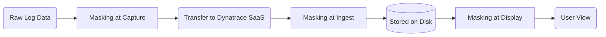

* **[Data Privacy Overview](#Data%20Privacy%20Overview)**
* **[RUM Data Privacy Settings](#RUM%20Data%20Privacy%20Settings)**
* **[Session Replay Privacy](#Session%20Replay%20Privacy)**
* **[Credential Vault](#Credential%20Vault)**
* **[Log Masking](#Log%20Masking)**
* **[Levels of Data Protection](#Levels%20of%20Data%20Protection)**
* **[Data Retention Periods](#Data%20Retention%20Periods)**

---

## Data Privacy Overview
Dynatrace enables you to stay in full control of your data while meeting global compliance obligations.

Relevant standards: **GDPR**, **CCPA**, **HIPAA**, **LGPD**, **PCI-DSS**

> [!NOTE]
> #### Company accountability
> Companies are held accountable for **transparency**, **fairness**, and **accuracy** in how they collect, store, use, and protect personal data. Dynatrace provides the tools — but it's the admin's responsibility to configure them correctly.

## RUM Data Privacy Settings
Real-User Monitoring captures live user behaviour. Before collecting, ensure your organisation has taken all necessary steps to protect customer data.

Configurable options include:
* **Opt-in mode** — decide which parts of a user session get recorded; allows users to consent
* **URL exclusion** — exclude specific pages or views from recording
* **Masking** — prevent recording and display of private user information

## Session Replay Privacy ©
Session Replay stores recordings of user sessions. Access to these recordings is **permission-controlled**.

Two replay permissions (available at environment and management-zone level):
* **"Replay sessions with masking"**
* **"Replay sessions without masking"**

> [!IMPORTANT]
> Only grant these permissions to individuals and teams with a **genuine business justification** for accessing session data.

Configure at: **General Settings → Data Privacy → Session Replay**

## Credential Vault ©
A centralised, secure repository for credentials used by:
* **Synthetic monitors** (browser and HTTP)
* **Extensions 2.0**
* **AppEngine apps**

Stores:
* Username-password pairs
* Certificates
* Tokens

> [!IMPORTANT]
> The contents of credentials are **not visible to any user**, including the creator.
> They are visible **only to the synthetic monitors** that reference them.

## Log Masking ©
Logs may contain sensitive data (tokens, API keys, PII). Dynatrace provides two masking methods — **recommended to combine both**.

#### Method 1: Masking at Capture
* Masks sensitive data **before** it is transferred to Dynatrace SaaS
* Uses **OneAgent** on hosts and processes
* Configure at: **Settings → Log Monitoring → Sensitive data masking**

#### Method 2: Masking at Ingest
* Masks sensitive data **once it arrives** in Dynatrace SaaS
* Applied **before it is written to disk** (stored)
* Uses **log processing rules**

> [!TIP]
> Combining both methods sets up **two layers of security** — recommended best practice.

## Levels of Data Protection ©
Three levels are available depending on your environment setup and legal obligations.

| Level | When it applies |
|---|---|
| **Masking at capture** | Before data leaves the host |
| **Masking at storage** | Before data is written to disk in Dynatrace |
| **Masking at display** | Controls what users see in the UI |

> Apply the most restrictive level your compliance requirements demand.

## Data Retention Periods ©

> [!IMPORTANT]
> These are **commonly tested** — know the defaults for each data type.

#### User Session Data (RUM)
| Data type | Default retention |
|---|---|
| User sessions (events & interactions) | **35 days** |
| Session Replay data | **35 days** (stored on dedicated disk) |
| Crash data & stack traces (mobile/custom) | **35 days** |

#### Distributed Traces
| Data type | Default retention |
|---|---|
| Complete transaction details | **10 days** |
| Code-level insights (with OneAgent) | **10 days** |
| Custom bucket retention for spans | 10 days to 10 years |

> After 10 days, trace data is optimised for **aggregated views** only.

#### Logs (Grail / Log Management and Analytics)
| Data type | Default retention |
|---|---|
| Default bucket (`default_logs`) | **35 days** |
| Configurable range | 1 day to 10 years (+1 week = max **3,657 days**) |

> Log Monitoring Classic: stored in **Amazon Elastic File System**

#### Metrics
| Data type | Default retention |
|---|---|
| Metrics powered by Grail | **15 months (462 days)** at 1-min granularity |
| Metrics bucket range | 15 months to 10 years (3,657 days) |

> No extra charge for Retain **within** the default 15-month period.

#### Grail Buckets (General)
* Custom buckets: retention from **1 day to 10 years + 1 week**
* Configurable per bucket with **day-level granularity**
* Different data types go into different bucket types (logs, spans, metrics, etc.)

#### Adaptive Data Retention
Dynatrace periodically **adjusts retention** if the tenant storage quota is exceeded:
* Retention time is **decreased** if the environment uses more disk than quota allows
* Once enough data is deleted, retention time **increases again**
* Applies to: **transaction storage**, **Session Replay**, **Log monitoring data**

---
