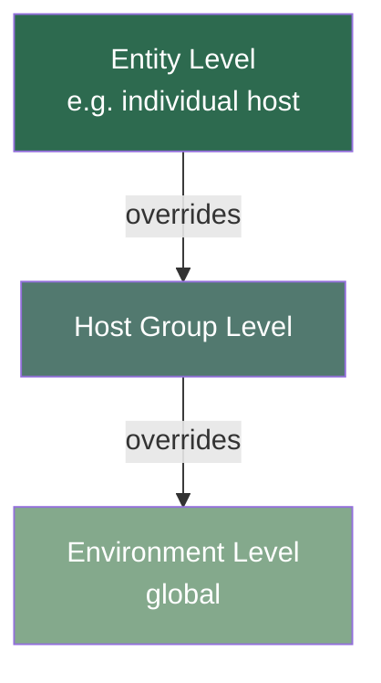
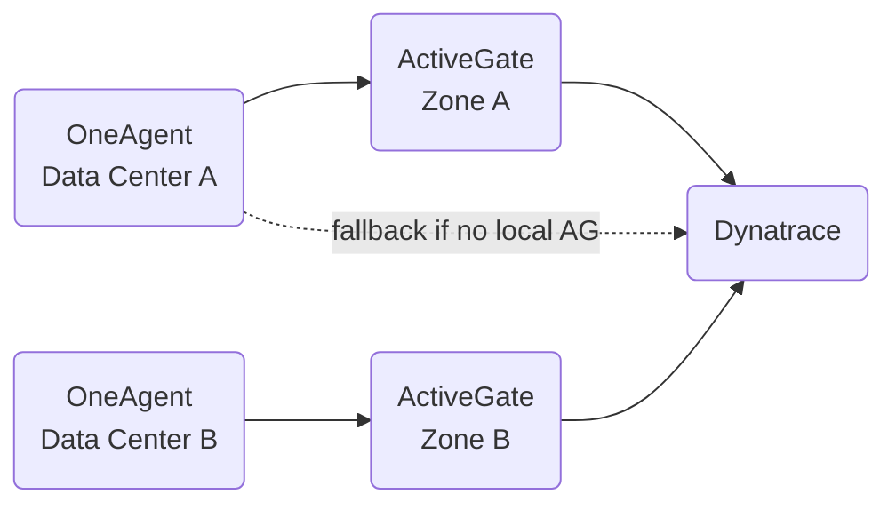

* **[Settings Scope & Hierarchy](#Settings%20Scope%20%26%20Hierarchy)**
* **[Configuration Revision History](#Configuration%20Revision%20History)**
* **[Settings API](#Settings%20API)**
* **[DQL Queries for Admins](#DQL%20Queries%20for%20Admins)**
* **[OneAgent Features](#OneAgent%20Features)**
* **[Network Zones](#Network%20Zones)**
* **[Management Zones](#Management%20Zones)**
* **[Host Groups](#Host%20Groups)**
* **[Anomaly Detection](#Anomaly%20Detection)**
* **[Maintenance Windows](#Maintenance%20Windows)**
* **[Ownership of Monitored Entities](#Ownership%20of%20Monitored%20Entities)**

---
## Settings Scope & Hierarchy ©
Many settings can be configured at different scopes. The **most specific setting always wins**.

> **Best practice**: Manage settings at the **highest possible level**. High-level settings scale automatically to every child entity — you don't need to apply them manually.

#### Checking Overrides
Navigate to any setting → **More (…) → Hierarchy and overrides**
- Shows entity-level overrides of the environment-level setting
- Allows navigation between parent and child settings

---
## Configuration Revision History
Every **Settings 2.0** configuration maintains a **history of changes**:
- Tracks **who changed what** and **when**
- Critical for **auditing** purposes

> [!TIP]
> If you're asked to prove a configuration change was made — or identify who caused an issue — the revision history is where you go.

---
## Settings API
The **Settings 2.0 framework** provides a unified instrument to control Dynatrace configurations.

> Whether you use the **web UI** or the **Settings API**, you're setting the **same configurations** with the same effect.

Use the Settings API to:
* View or modify **schema parameters**
* Create, edit, or delete **settings objects**
* Automate configuration changes across environments

---
## DQL Queries for Admins
Use DQL to investigate administrative scenarios:
* Review **system events**
* Determine causes of **data deletion**
* Investigate **excess licensing consumption**

> Run queries in **Notebooks** or any DQL-enabled interface.

---
## OneAgent Features
When you create an environment, OneAgent comes with a large set of features **activated by default**.

> [!IMPORTANT]
> Features added by **newer versions** of OneAgent and **opt-in features** (e.g., automatic log enrichment with trace ID) must be **explicitly activated**.

---
## Network Zones
Network zones represent your **network structure** as Dynatrace entities.

Purpose: **route traffic efficiently**, avoiding unnecessary cross-data-center traffic.

- OneAgents **prefer ActiveGates in the same network zone**
- Falls back to direct cluster connection if no zone ActiveGate available

#### Deployment
Overall steps are the same for both scenarios:
- **New installation** — configure during fresh Dynatrace deployment
- **Migration** — add network zones to an existing deployment

Configure connectivity for both **OneAgents** and **ActiveGates**.

---
## Management Zones
A **powerful information-partitioning mechanism** that promotes team focus and access control.

Key characteristics:
- Management zones **may overlap** (just as team responsibilities might overlap)
- Users see **auto-filtered views** based on their management zone access
- Users with multiple zones can **filter all Dynatrace views** to a single zone
- Rules-based: entities are matched to zones by rules

Access levels:
- Entire environment
- Specific management zone
- Subset of related management zones

> [!TIP]
> Management zones are ideal for separating teams (frontend vs backend), environments (prod vs non-prod), or regions — without duplicating configurations.

---
## Host Groups
Sets of hosts that share similar characteristics or purposes. Each group can be configured at the **host-group level**, making it easy to change settings for many hosts at once.

Configurable per host group:
- **Alerting thresholds**
- **OneAgent update settings**

> A **host can only belong to one host group**. Groups are typically defined during OneAgent installation. To change, reinstall OneAgent or use `oneagentctl`.

> More on host groups & process group separation → **[1. Platform Health & Configuration](1__Platform_Health_and_Configuration.md)**

---
## Anomaly Detection ©
Dynatrace **continuously monitors** every aspect of your applications, services, and infrastructure to automatically learn baseline metrics.

Variables automatically factored in:
- Geolocation
- Browser type
- Operating system
- Connection bandwidth
- User actions

> By default, a metric must exceed the baseline by **50%** for Dynatrace to detect an anomaly.

#### Components of an Anomaly Detection Configuration ©
1. **Data source** — a time series evaluated (DQL query or specific metric)
2. **Analyzer type and parameters** — how the data is evaluated
3. **Sliding window** — period over which data is evaluated
4. **Event template** — what kind of event is triggered

#### Threshold Types
- **Static thresholds** — waits ~5 min to confirm the condition persists before triggering
- **Auto-adaptive baselines** — established after 2 hours, refined daily, mature after ~1 week

#### Anomaly Detector App ©
> [!IMPORTANT]
> Configurations in the **Anomaly Detector app** will **NOT carry over** to the classic Dynatrace platform, and vice versa. They are **separate streams**.

Preview results in:
- **Davis for Notebooks** (latest Dynatrace)
- **Metric event preview** (classic)

---
## Maintenance Windows ©

> [!NOTE]
> #### Why define them?
> Maintenance windows let Dynatrace identify periods of **possibly abnormal operation** — downtimes, reduced performance, load tests. This keeps your baselines clean and prevents alert spam.

#### Two Types ©
| Type | Use case |
|---|---|
| **Planned** | Configured in advance for scheduled maintenance |
| **Unplanned** | Added retroactively for unexpected downtime |

#### Problem Detection Options ©
Three options during a maintenance window:
1. **Detect problems and alert** — normal detection + maintenance window icon on problems
2. **Detect problems but don't alert** — problems listed with icon, but **NO alerts sent**
3. **Disable problem detection** — nothing detected, no alerts, nothing on Problems page

Additional toggle: **disable synthetic monitor execution** during maintenance.

#### Schedule Options
- One-time, daily, weekly, or monthly recurrence
- Time zone configurable

#### Scope & Filters ©
- Filter by: entity type, specific entity, entity tags, management zones
- An entity must match **ALL conditions within a single filter**
- Multiple filters use **OR logic** between them

> [!IMPORTANT]
> If **no filters are defined**, the **entire environment** goes into maintenance mode!

#### Baselining Impact
- Maintenance windows are **automatically excluded** from baseline calculations
- Response time anomalies during maintenance won't influence future baselines

> **Best practice**: Define maintenance windows **before load testing**.

---
## Ownership of Monitored Entities
Assigning team owners to entities drives **DevSecOps collaboration** and faster incident resolution.

Ownership enables automation such as:
- **Notification** of relevant teams about production issues
- **ITSM ticket creation** (Jira, ServiceNow) assigned to the right teams
- **Vulnerability assignment** to responsible team members
- **Stakeholder information** provision

> Follow best practices to scale ownership effectively and minimise tagging run time.

---
