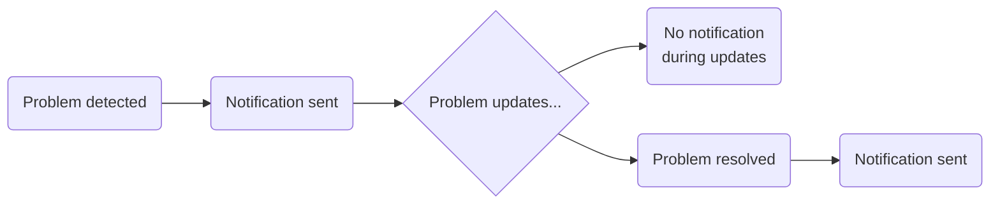

* **[Problem Notifications](#Problem%20Notifications)**
* **[Alerting Profiles](#Alerting%20Profiles)**
* **[ServiceNow Integration](#ServiceNow%20Integration)**
* **[Workflows for Automation](#Workflows%20for%20Automation)**

---
## Problem Notifications
Dynatrace automatically detects abnormal system behaviour and creates a **single problem** containing all incidents that share the same root cause.

#### How notifications work ©
- Notifications are pushed **automatically** to third-party incident management or ChatOps services
- Open problems are **continuously updated** as impact evolves and events correlate
- To **avoid notification spam**: notifications are only pushed **when problems are initially detected** AND **when they are resolved** — not for every update in between

---
## Alerting Profiles ©
Alerting profiles **control the delivery** of problem notifications across your organisation's alerting channels.

Filter criteria available:
- **Severity** of the problem
- **Customer impact** level
- **Tags** on affected entities
- **Duration** of the problem

> [!TIP]
> #### Delayed vs. Immediate notifications
> Combine filter criteria to create custom profiles. For example:
> - **Delay** notifications for problems in **development** environments
> - **Immediately alert** on problems in **production** environments

An alerting profile is then linked to a **Problem Notification Integration** (e.g., Slack, PagerDuty, Opsgenie, email). Think of the profile as the filter and the integration as the delivery channel.

---
## ServiceNow Integration
Dynatrace can be integrated with a ServiceNow instance for **automatic creation and updating** of incidents in both systems.

Configuration required on:
1. The **ServiceNow instance** side
2. The **Dynatrace web UI** side

---
## Workflows for Automation
Workflows automate responses using observability and security data.

Use cases:
* **Inform stakeholders** through communication tools (email, Slack, etc.)
* **Open incident tickets** in ITSM systems
* **Trigger configuration management** tools
* **Remediate directly** — execute Kubernetes jobs or create pull requests

> [!NOTE]
> Workflows are built on top of **AutomationEngine** and integrate with many third-party systems.
> More detail on Workflows → **[5. Data Visualisation](5__Data_Visualisation.md#Workflows)**

---
