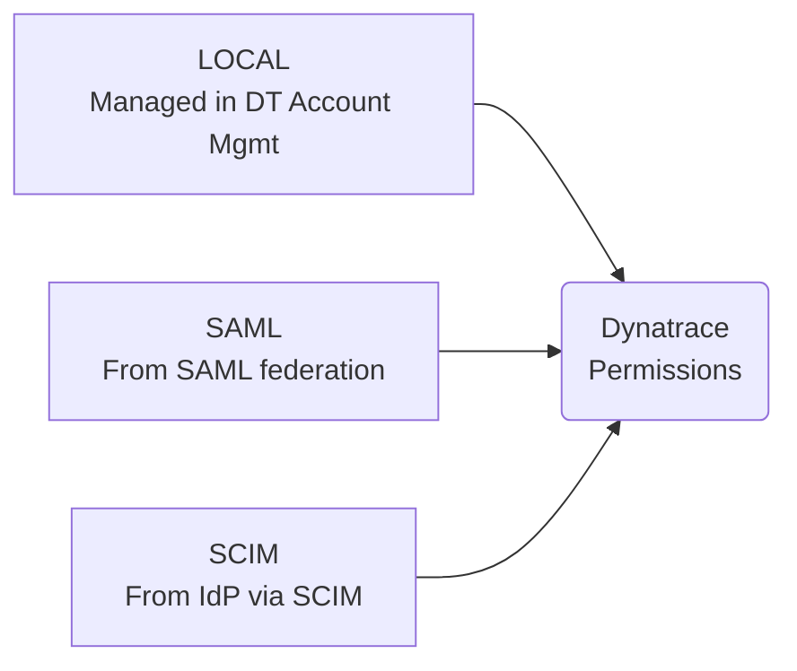
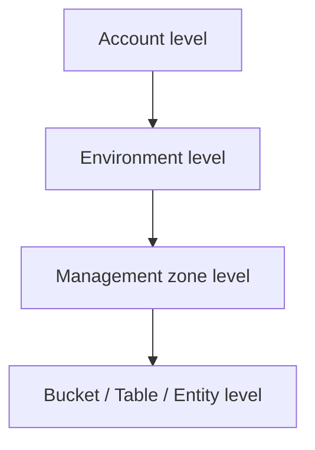

* **[Groups Overview](#Groups%20Overview)**
* **[Group Types](#Group%20Types)**
* **[SAML Configuration](#SAML%20Configuration)**
* **[SCIM Configuration](#SCIM%20Configuration)**
* **[Access Control Models: RBAC vs ABAC](#Access%20Control%20Models%3A%20RBAC%20vs%20ABAC)**
* **[Permissions & Policies](#Permissions%20%26%20Policies)**
* **[Buckets for Data Access](#Buckets%20for%20Data%20Access)**
* **[Entity Selector](#Entity%20Selector)**

---
## Groups Overview
In Dynatrace, user permissions are managed via **group membership** — users inherit the access permissions assigned to the groups they belong to.

> [!NOTE]
> #### Default Group
> All users are automatically assigned to the **"Default group with all users"** group.
> This group is seeded with **minimum permissions** and cannot be removed.

---
## Group Types ©
Three types based on their source:

| Type | Source | Modifiable? |
|---|---|---|
| **LOCAL** | Dynatrace Account Management | Yes |
| **SAML** | SAML group attribute claims during login | Yes (via SAML config) |
| **SCIM** | Automatically synced from IdP | **Cannot** be removed or modified through Account Management |

> Permissions from **all group types** (LOCAL, SAML, SCIM) are **joined together** for a user.

---
## SAML Configuration ©
SAML enables SSO by delegating authentication to your organisation's Identity Provider.

#### Key Facts ©
- Supports **Just-In-Time (JIT)** user creation during login
- Domain verification TXT record **can be removed** after validation
- **Full DN not allowed** in group attributes (commas are treated as delimiters)
- **MFA must be configured through your IdP**, not in Dynatrace
- **Break Glass**: invite a non-federated user with Account manager permissions in case of IdP outage
- Whole messages need to be **signed** (including sign-out requests and responses)

#### SAML Groups ©
- Created when SAML group attribute values are **mapped to local groups**
- Membership is determined by **SAML group claims during login**
- Changing a local group to SAML **changes the source**

---
## SCIM Configuration ©
SCIM enables **automatic provisioning and sync** of users and groups from your IdP.

#### Key Facts ©
- Supports **Bearer Token Authentication only**
- Can generate up to **10 SCIM authentication tokens**
- Users in SCIM groups are **not listed in the sharing UI** unless also added to local groups
- **Cannot set group description** during SCIM provisioning
- Email/login changes may **break SCIM** if the client doesn't support dynamic external IDs
- Synchronisation is **one-way: IdP → Dynatrace only**
- Permissions must still be **assigned manually** in Dynatrace (SCIM only syncs group membership)

> [!IMPORTANT]
> SCIM groups **cannot be removed or modified** through Account Management. They are controlled by the IdP.

---
## Access Control Models: RBAC vs ABAC ©

| | RBAC | ABAC |
|---|---|---|
| **Full name** | Role-Based Access Control | Attribute-Based Access Control |
| **Approach** | Legacy / simpler | Recommended / modern |
| **Scope** | Environment or management zone level | Policies using user, resource, data & contextual attributes |
| **Granularity** | Limited predefined roles | Much more fine-grained control |
| **Dynatrace recommendation** | Upgrade to ABAC | ✅ Preferred model |

> [!TIP]
> Dynatrace **recommends upgrading from RBAC to ABAC** for better granularity and scalability.

---
## Permissions & Policies ©
Permissions can be assigned at multiple levels:

- ABAC uses **policies** that encapsulate permissions against resources and data
- Policies leverage: **user attributes**, **resource attributes**, **data attributes**, **contextual attributes**
- Assign policies to **groups** to grant permissions to users

---
## Buckets for Data Access ©
Permissions can be assigned at the **bucket**, **table**, and **entity** levels.

> [!IMPORTANT]
> Without permissions, users **cannot fetch any data** from a bucket or table.

Benefits of using custom buckets:
- **Improved query performance** — reduces query execution time and scope
- **Streamlined permission management** — grant access to relevant data per team

#### Retention Models per Bucket
| Model | Description |
|---|---|
| **Usage-based** | Each query is charged separately |
| **Retain with Included Queries** | Data within a defined timeframe included in cost (Included Queries: 10–35 days; overall up to 10 years) |

> Built-in buckets are available. Administrators can also define **custom buckets** for specific retention periods or compliance requirements.

---
## Entity Selector ©
A powerful instrument for specifying which entities are in scope for API calls, tagging, management zones, and more.

Filter by:
- **Tag**
- **OS version**
- **Entity type**
- **Any property value**

> [!TIP]
> #### Learn the syntax once, reuse everywhere
> The entity selector uses the **same syntax** across multiple APIs — Environment v2 API, metrics fetching, tagging, management zone assignment, and more.

Example use cases:
- Select all hosts with a specific tag
- Fetch metrics for all services of a given entity type
- Assign resources to a management zone by property value

---
