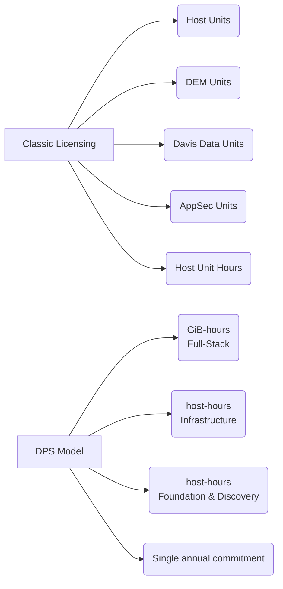

* **[Licensing Models Overview](#Licensing%20Models%20Overview)**
* **[Classic Licensing — Host Units](#Classic%20Licensing%20%E2%80%94%20Host%20Units)**
* **[Classic Licensing — Davis Data Units (DDU)](#Classic%20Licensing%20%E2%80%94%20Davis%20Data%20Units%20(DDU))**
* **[Dynatrace Platform Subscription (DPS)](#Dynatrace%20Platform%20Subscription%20(DPS))**
* **[What Happens When Limits Are Breached](#What%20Happens%20When%20Limits%20Are%20Breached)**
* **[Cost Monitors](#Cost%20Monitors)**
* **[Budgets](#Budgets)**
* **[Account Management Portal](#Account%20Management%20Portal)**

---

## Licensing Models Overview ©

## Classic Licensing — Host Units ©

#### Full-Stack Mode Weighting (based on RAM) ©
| RAM | Host Units |
|---|---|
| < 2 GiB | 0.1 HU |
| 2 GiB | 0.1 HU |
| 4 GiB | 0.25 HU |
| 8 GiB | 0.5 HU |
| 16 GiB | 1.0 HU |
| 32 GiB | 2.0 HU |
| 48 GiB | 3.0 HU |
| +16 GiB increments | +1.0 HU |

> [!IMPORTANT]
> **Rounding rule**: When RAM falls between values, **round UP**.
> - 12 GiB RAM → **1.0 HU** (between 8 GiB and 16 GiB)
> - 18 GiB RAM → **2.0 HU** (between 16 GiB and 32 GiB)

#### Infrastructure Mode ©
* Same weighting table as Full-Stack × **0.3 coefficient**
* **Capped at 1.0 host unit per host** maximum

#### Host Unit Hours
* Allow flexible consumption for traffic spikes (e.g., Black Friday)
* Example: `9,000 HU-hours ÷ 24 hours = 375 additional host units for one day`

## Classic Licensing — Davis Data Units (DDU) ©

#### DDU Pools
| Pool | Default enforced? |
|---|---|
| Metrics | No |
| Log Monitoring | No |
| Events | No |
| Traces | No |
| Serverless | No |

> By default, **pool limits are NOT enforced**.

#### DDU Weights per Data Type ©
| Data type | DDU weight |
|---|---|
| Custom metric data point | **0.001 DDU** |
| Log record (Classic) | **0.0005 DDU** |
| Custom Davis event | **0.001 DDU** |
| Trace span (via Trace API) | **0.0007 DDU** |
| Serverless function invocation | **0.002 DDU** |

#### Log Management and Analytics (Grail-based) ©
Total DDU cost = **Ingest & Process** + **Retain** + **Query**
* Ingest & Process: **100.00 DDUs per GB**

#### Included Metrics (no DDU cost) ©
* **Full-Stack** monitored host: **1,000 metrics** per host unit included
* **Infrastructure** monitored host: **200 metrics** included (always)
* **OneAgent default host metrics**: always **free**, no DDUs
* Metrics ingested by extensions bound to hosts **consume included metrics first**

> [!TIP]
> #### Free Tier
> Every new SaaS environment gets **200,000 DDUs free of charge**.

#### DDU Notifications ©
* In-product banner at **90%** consumed
* In-product banner at **100%** consumed

## Dynatrace Platform Subscription (DPS) ©
A modern, flexible licensing model.

> **Single commitment. Any capability. Any volume. Anytime.**

| Feature | Detail |
|---|---|
| Commitment model | Annual (1–3 year contracts) |
| Full-Stack unit | **GiB-hours** (memory-gibibyte-hours) |
| Infrastructure unit | **host-hours** (flat, regardless of memory) |
| Foundation & Discovery unit | **host-hours** |
| Included custom metrics (Full-Stack) | 900 per GiB of host memory per 15-min interval |
| Included custom metrics (Infrastructure) | 1,500 per host per 15-min interval |

Enables access to: **AI observability**, **Grail**, **AppEngine**, **AutomationEngine**

## What Happens When Limits Are Breached ©
When the configured limit for concurrent host units is reached (and no overages are allowed):

* Dynatrace **stops monitoring some hosts**
* Decision is based on **OneAgent start times** — **newest agents are stopped first**
* Overages are calculated **per account**, not per environment

## Cost Monitors ©
Help manage your DPS budget and identify **unexpected cost increases**.

* Monitor **overall forecasted usage** and warn when costs increase significantly
* Monitor **daily costs** at the capability and environment levels
* Alert when costs **exceed predicted levels**

## Budgets ©
Track costs against **user-defined thresholds**.

Can be set at:
* **Account** level
* **Environment** level
* **Capability** level

Configure **email notifications** when budgets are exceeded.

> [!NOTE]
> Budgets **complement** the Cost Monitor feature — they define custom thresholds, while Cost Monitors track forecasted usage patterns.

## Account Management Portal
A single place to:
* Manage **licenses and subscriptions**
* Manage **users and SSO access** (SaaS deployments only)
* Monitor **platform adoption and environment health**

Provides:
* **Real-time view** of licensed product consumption (Total license usage)
* **Historical analysis** at daily or hourly level (Usage details)

---
