* **[Community](https://community.dynatrace.com)**
* **[Documentation](https://docs.dynatrace.com/docs?utm_source=google&utm_medium=cpc&utm_term=dynatrace%20documentation&utm_campaign=ww-ww-all-en-brand-tcpa&utm_content=none&utm_campaign_id=11440026394&gad_source=1&gad_campaignid=11440026394&gbraid=0AAAAADk5-tW1Og2bvqmGv0t9nFDc26I9o&gclid=CjwKCAiAmp3LBhAkEiwAJM2JUAdnUlQHHZoQPDouMRvr102cgPcM0dtYu-_ju9YXTOYHSx-R2yzGkhoCg_kQAvD_BwE)**
* **[Official Repository](https://github.com/Dynatrace)**
* **[Official Website](https://www.dynatrace.com/)**
* **[Playground](https://www.dynatrace.com/signup/playground/)**
* **[University](https://university.dynatrace.com/learn?utm_source=google&utm_medium=cpc&utm_term=dynatrace%20university&utm_campaign=ww-ww-all-en-brand-tcpa&utm_content=none&utm_campaign_id=11440026394&gad_source=1&gad_campaignid=11440026394&gbraid=0AAAAADk5-tW1Og2bvqmGv0t9nFDc26I9o&gclid=CjwKCAiAmp3LBhAkEiwAJM2JUD0q9d33MLzVlLjmMDcQEAFYuo79k-G2dQc5CE5CZvmte6UzIkqgIxoCfboQAvD_BwE)**

---

## Dynatrace Certification Study Guides
A comprehensive collection of study notes, summaries, and practical examples to help you and me prepare for **Dynatrace Certifications**. 

## Project Overview
This repository serves as a centralised knowledge base for mastering the Dynatrace platform. It contains structured `.md` (Markdown) summaries based on official documentation, hands-on experience, and exam blueprints.

> Although this repository allows you to read **.md** files on GitHub directly, it is highly recommended to download **Obsidian** and work with texts from there. You can clone the repository on your device and open it as a vault in Obsidian.
> 
## Repository Structure
The content is organised into different levels of Certificates:

0. **[Essentials](0%20Essentials/README.md)**
1. **[Associate](1%20Associate/README.md)**
2. **[Administration Professional](2%20Administration%20Professional/README.md)**
>
3. **Implementation Professional**
4. **DEM and Business Analytics Specialist**
5. **Advanced Automation Specialist**
6. **Advanced Observability Specialist**
7. **Advanced Security Specialist**
8. **Application Development Specialist**
> 
9. **Professional**
10. **Ambassador**

---

| 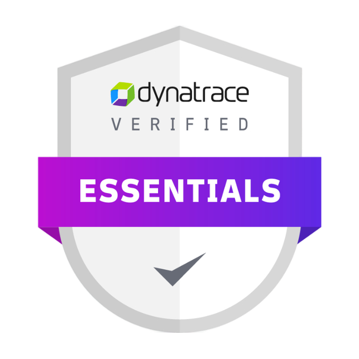 | 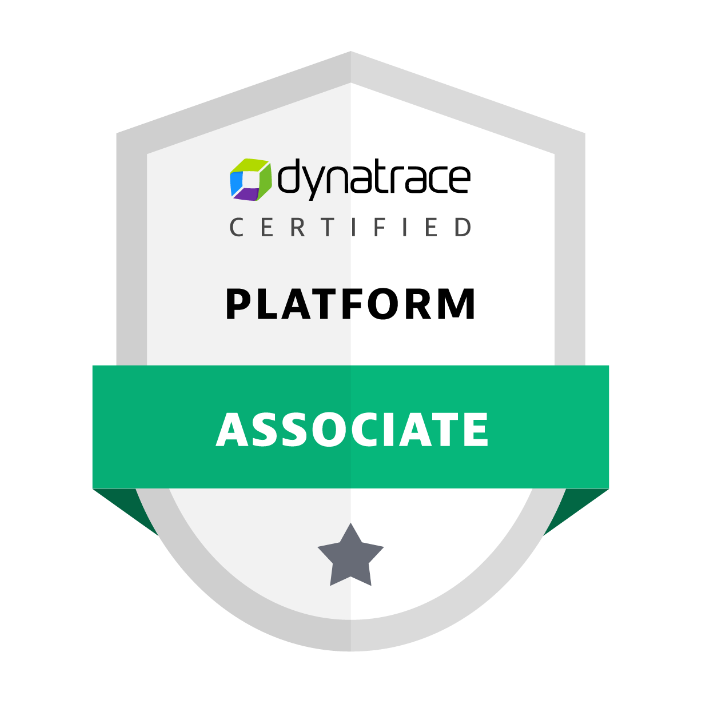 | 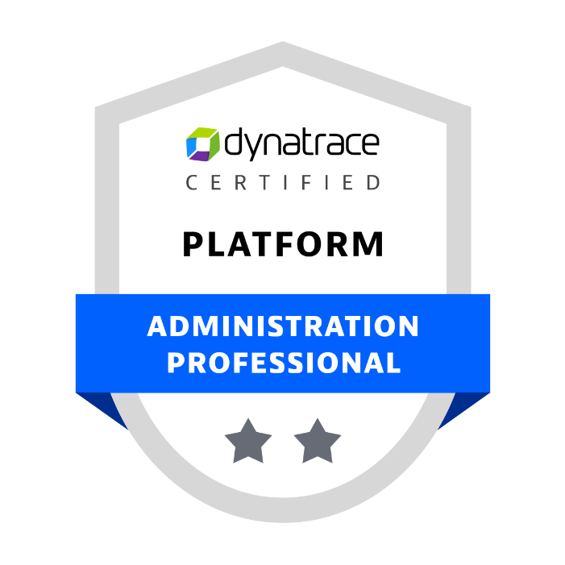  | 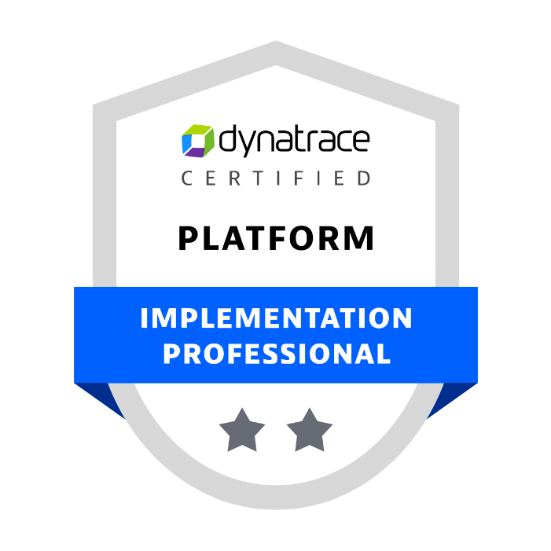  |
| ---------------------- | ---------------------- | ----------------------- | ----------------------- |
| 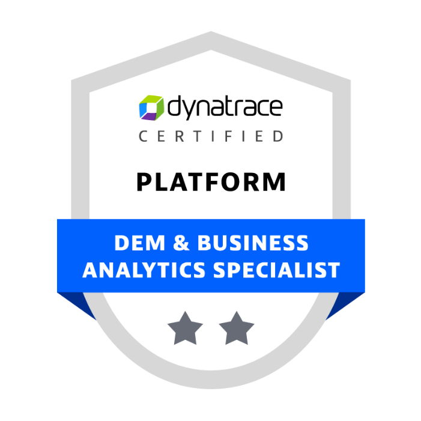 | 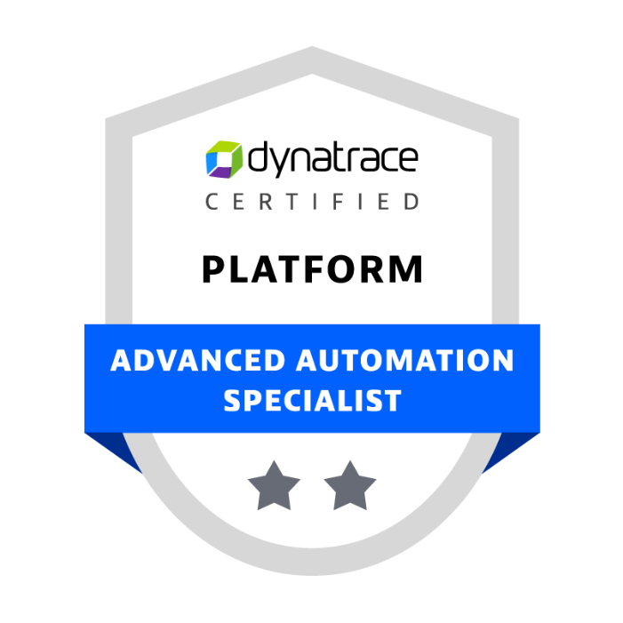 | 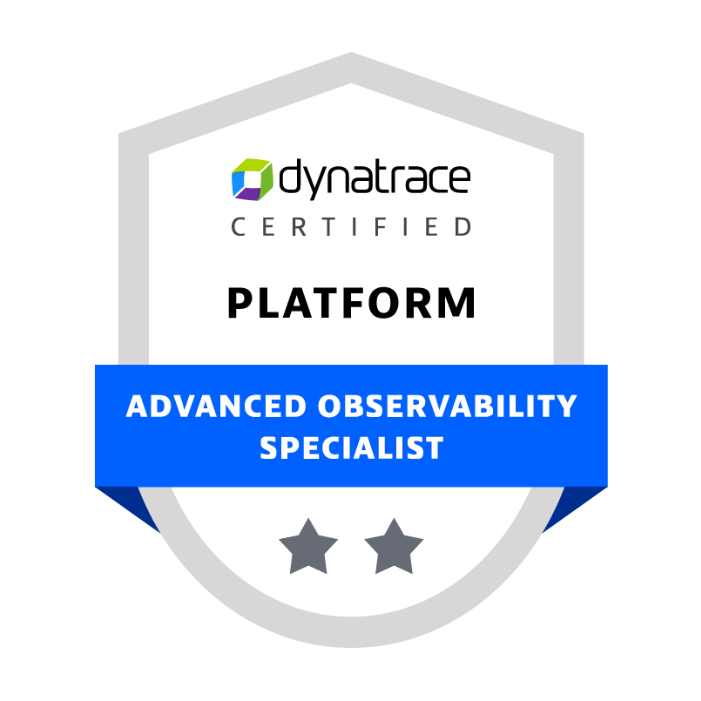  | 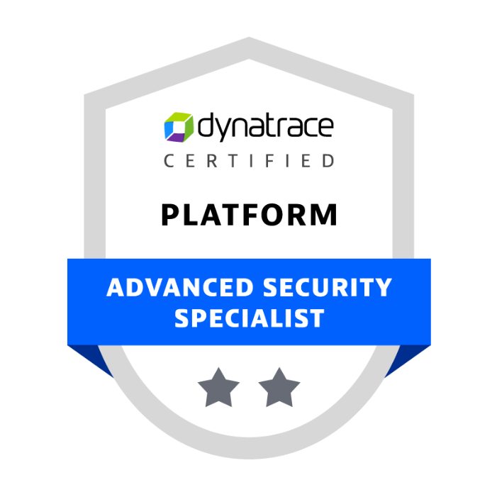  |
| 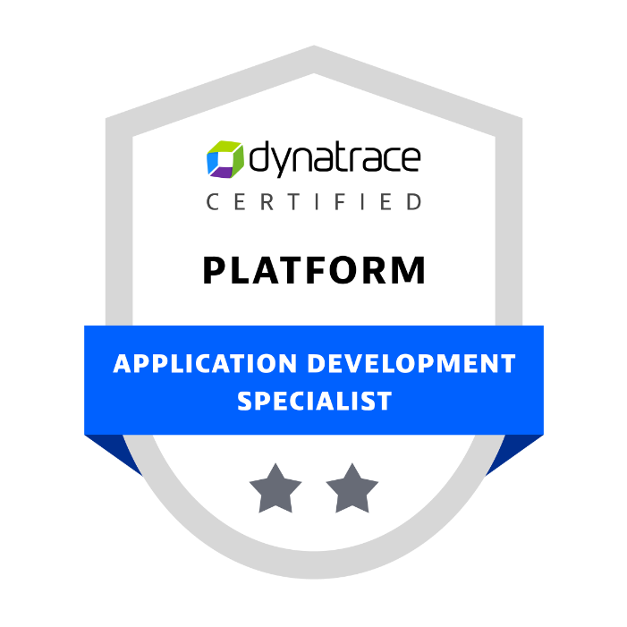 | 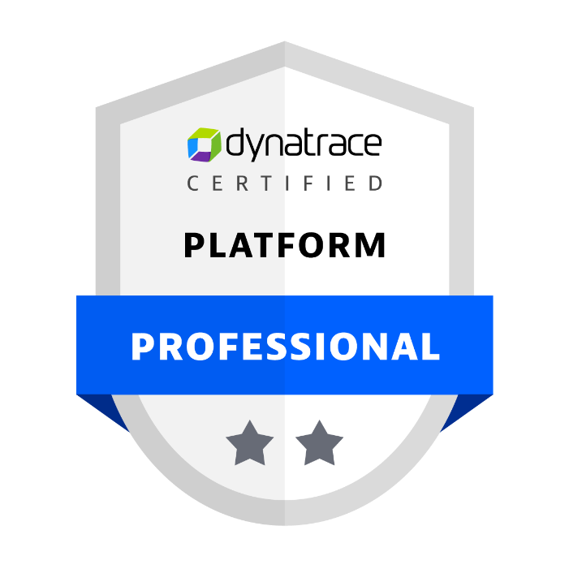 | 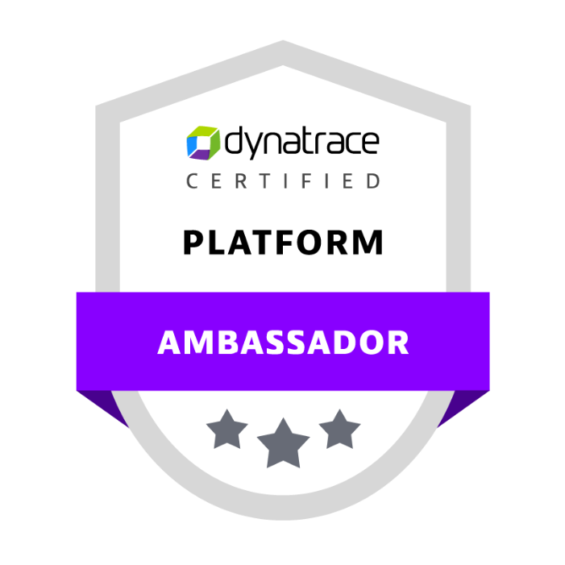 | 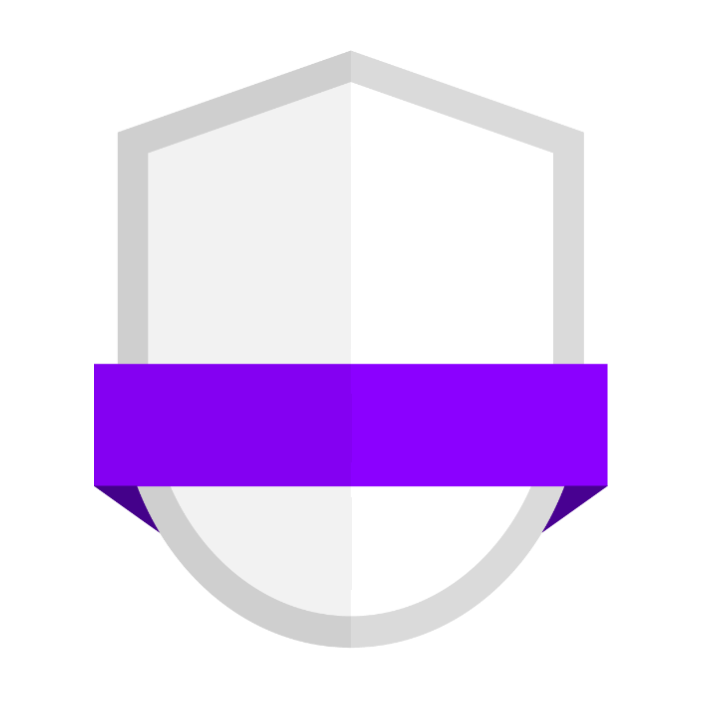 |

---